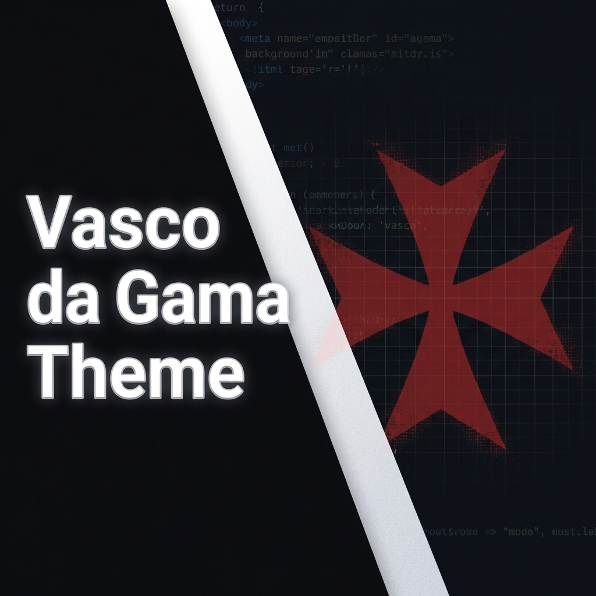
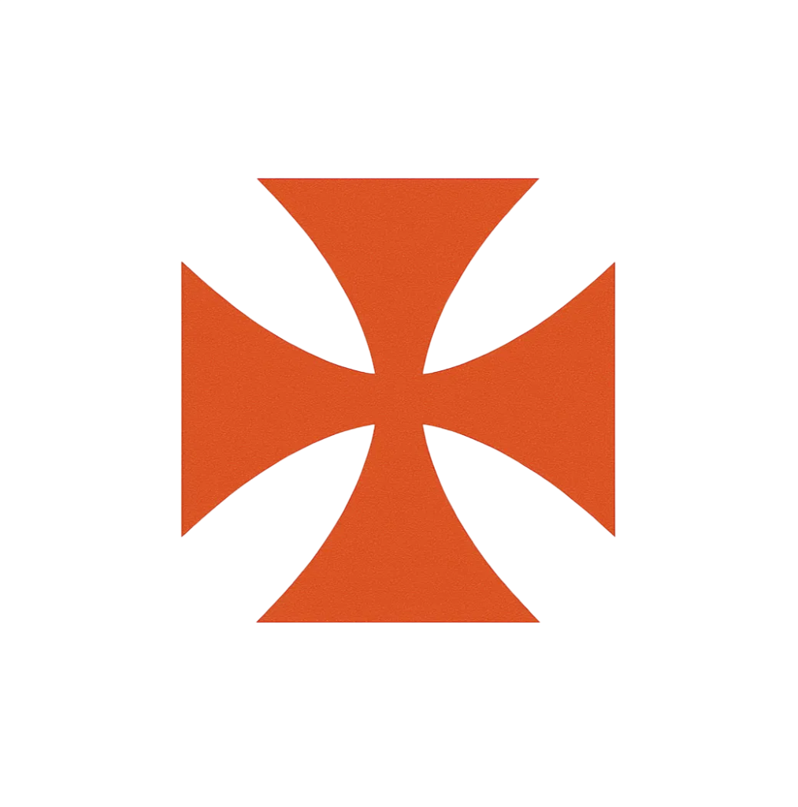

  
  
   
  
  

  <h1>Vasco da Gama Theme</h1>

  

    <strong>O tema definitivo para os torcedores do Gigante da Colina.</strong> 
    Traga a tradição, a força e as cores do Vascão para o seu VS Code.
  

  

    
    
    
  

  

    
    
  

## 📖 Sobre

Este não é apenas um tema, é uma **declaração de amor**. Desenvolvido cuidadosamente para oferecer um ambiente de desenvolvimento visualmente agradável, com alto contraste e as cores históricas do Club de Regatas Vasco da Gama. Perfeito para programar até tarde da noite torcendo para o Vascão.

## ✨ Funcionalidades

### 🎨 Cores do Vascão
Um tema escuro elegante ("Dark High Contrast") com acentos em vermelho, branco e preto, garantindo:
- **Leitura confortável** por longos períodos.
- **Sintaxe destacada** para fácil identificação de erros.
- **Interface limpa** e focada.

### 📂 Ícones Exclusivos (`Vasco Icon Theme`)
Substituímos os ícones padrão por símbolos que representam a nossa paixão:
- **HTML, CSS, JS e mais**: Ícones da Cruz de Malta em diferentes estilos (Sólido, Outline, Círculo).
- **Suporte Extenso**: Ícones dedicados para React, TypeScript, Python, Java, Docker, Git, e muitos outros.

### ⚡ Snippets (Atalhos de Código)
Ganhe produtividade e mostre sua torcida com atalhos exclusivos:

| Prefixo | Descrição | Resultado |
| :--- | :--- | :--- |
| `vasco` | Insere a Cruz de Malta em ASCII Art | `/* ...Arte ASCII... */` |
| `console-vasco` | `console.log` estilizado no browser | `console.log('%c ◤✠◢ VASCO ' ...)` |
| `vasco-saudacao` | Comentário motivacional | `// O Sentimento Não Pode Parar! /+/` |

## 🚀 Instalação

1. Abra o **VS Code**.
2. Acesse a aba de **Extensões** (`Ctrl+Shift+X`).
3. Pesquise por **"Vasco da Gama Theme"**.
4. Clique em **Instalar**.
5. Após instalar, selecione o tema de cores **Vasco da Gama** e o tema de ícones **Vasco da Gama Icons**.

## 📷 Preview

> *Imagine seu editor vestindo a camisa do Vascão.*

*(Adicione prints do seu editor aqui futuramente)*

## 🤝 Contribuição

Contribuições são sempre bem-vindas! Se você quer adicionar ícones para novas linguagens ou melhorar as cores:

1. Faça um **Fork** do projeto.
2. Crie uma **Branch** (`git checkout -b feature/NovaFeature`).
3. Realize o **Commit** (`git commit -m 'Adiciona suporte a linguagem X'`).
4. Faça o **Push** (`git push origin feature/NovaFeature`).
5. Abra um **Pull Request**.

---

  <strong>O Sentimento Não Pode Parar! ❤️◤✠◢🖤</strong>

